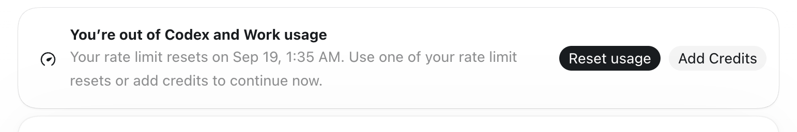
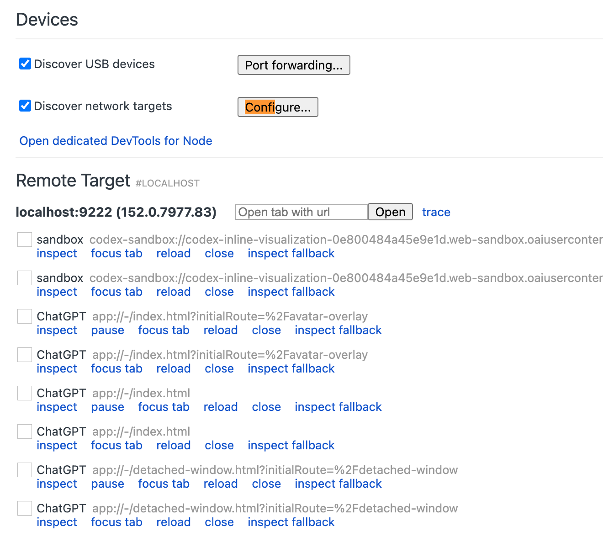

# X Article 草稿（中文）

> 建议标题：**《关不掉的提示框：我给 Codex Desktop 做了一次外科手术》**
> 备选标题：**《官方配置关不掉它，所以我写了 200 行脚本》**

---

额度用完的那一刻，Codex 会在界面上常驻一张卡片：



```text
You’re out of Codex and Work usage
Your rate limit resets on Sep 19, 1:35 AM.
Use one of your rate limit resets or add credits to continue now.
```

这不是一个 bug。提醒我额度用完了完全合理。真正的问题是它会一直挂在那里，每次打开都要看见一遍。

于是我想把它关掉。我也给自己定了一条底线：**不改服务端逻辑，不绕过 rate limit，只隐藏这个本地 UI 元素。**

最后的结果是 `codex-clean`，一个 200 行出头的 macOS 小工具。但中间走了三个死胡同，架构还推翻重做了一次。这个过程比脚本本身有意思，所以写下来。

## 一、官方配置关不掉它

第一反应是找官方开关。Codex 有 `config.toml`，里面确实有看起来相关的项：

```toml
[notice]
hide_rate_limit_model_nudge = true
```

没用。它只隐藏"额度用完后建议你换模型"的那条提醒。

```toml
[tui]
notifications = false
```

也没用，那只影响通知。

结论：这个提示框没有任何官方配置可以关掉。既然它是 UI，那它就在 DOM 里。

## 二、连进 Electron

ChatGPT / Codex Desktop 是 Electron 应用，可以带着调试端口启动：

```bash
open -n /Applications/ChatGPT.app --args --remote-debugging-port=9222
```

然后在 `chrome://inspect` 里连上 `localhost:9222`，会看到一堆 renderer：

```text
sandbox
ChatGPT  app://-/index.html
ChatGPT  app://-/detached-window.html
```

实际打开 `chrome://inspect` 是这样的，同一个 `localhost:9222` 下挂着一串目标：



真正承载主界面的只有 `app://-/index.html`。连错目标，就会得到"界面上明明有这段文字，但 `innerText` 里找不到"的结果。

## 三、第一个坑：弯引号

在正确的 renderer 里输入：

```js
document.body.innerText.includes("You're out of Codex and Work usage")
```

返回 `false`。

但那行字就在屏幕上。

原因是界面用的是 Unicode 弯引号：

```text
You’re     ← 界面上的
You're     ← 我在代码里打的
```

这个坑换来一条永久性决定：后面所有匹配都不再包含引号，只匹配这一小段：

```js
"out of Codex and Work usage"
```

不碰引号，就不会再被引号咬到。

## 四、第二个坑：隐藏错了层级

第一版逻辑是"找到含这段文字的元素，往上找到同时包含 `Reset usage` 和 `Add Credits` 的节点，然后 `display: none`"。

结果是半成功：文字没了，按钮没了，但**圆角边框还在、usage 图标还在、整块空白占位也还在**。

因为我隐藏的是卡片**内部的内容节点**，而不是卡片本身。外层容器还在那儿，只是被抽空了，看起来比原来更难看。

继续往上找，才找到真正的 wrapper：

```html
<aside class="relative isolate flex w-full ... rounded-3xl shadow-xs">
</aside>
```

于是整个方案收敛成一句话：

```js
document.querySelector("aside")?.style.setProperty("display", "none", "important");
```

这一次，文字、按钮、图标、圆角外框、占位空间一起消失。视觉上和这张卡片从未存在过一样。

## 五、第三个坑：React 会把它加回来

隐藏成功，但只维持到下一次渲染。手动改的 DOM 会被 React 覆盖回去。

解决办法是加一个 `MutationObserver`，而不是去猜渲染时机。

这里有一个刻意的取舍：**不用 CSS 类名匹配**。最省事的写法是匹配那串 Tailwind 类名，但类名会随前端每次构建变化，一旦变化就静默失效。所以我只保留两个条件：

```text
元素是 <aside>
+
文本包含 usage marker
```

选文本而不是结构，是为了让它活得更久。

## 六、真正的问题：切换 chat 之后它复活了

到这里第一版已经可用了。然后我切换了一下 chat：

```text
当前 chat：        banner 消失 ✓
切换到另一个 chat：banner 又出现 ✗
```

v1 的架构里有一个隐含假设：脚本启动时存在的那个 renderer 会一直存在。但 Codex 切换 chat 时会新建或替换 renderer，新出现的 `app://-/index.html` 从来没有被注入过。

问题不在于"隐藏逻辑不够强"，而在于**注入这件事只做了一次**。

于是 v2 把注入从一次性动作变成常驻服务：后台 Node watcher 每 750ms 拉一次 CDP targets，发现新的 renderer 就立刻注入。渲染进程内部同时有四层保护：

```text
1. 监听新 renderer      → 每 750ms 轮询 CDP targets
2. MutationObserver     → React 重建 banner 就重新隐藏
3. SPA 路由变化          → pushState / replaceState / popstate / hashchange
4. 1 秒兜底扫描         → 前三层没捕获到也会全量重扫
```

## 七、边界在哪里

这个工具的定位必须说清楚：**它只是一个本地 UI customization。**

它不做的事：

```text
增加 usage
绕过 rate limit
修改账号额度
修改服务端状态
重置 usage
```

它做的全部事情就是 `display: none`。服务端的额度限制照常生效，该等就等。只是这张卡片不再出现在我眼前。

两个诚实的说明：

1. CDP 端口绑定在 `127.0.0.1`，不会暴露到局域网，但同机器上的本地进程理论上仍可访问。所以它适合当开发工具用，不是"开着别关"的常驻配置。
2. 这是针对未发布 UI 的做法，前端改版就可能失效。但因为匹配的是文本而不是类名，通常失效的时候，修法是改一行。

## 最后

整个过程里真正的收获有两条。

**匹配语义，不要匹配样式。** 类名和 DOM 结构都是实现细节，文本才更接近意图。选择匹配文本，让这个东西在改版之后仍然有较大概率继续工作。

**"能用"和"可靠"是两个不同的问题。** v1 在单次会话里完全能用，直到我做了那个再普通不过的动作——切换 chat。真正把方案定下来的不是隐藏逻辑，而是"注入只做了一次"这个判断。

代码在这里，MIT 协议，随便用随便改：

https://github.com/tempest2023/codex-clean

---

## 发布备注（不要复制到正文）

- 文章里已经放了两张图，都在本仓库里：`images/out-of-usage-banner.png`（我到底在去掉什么）、`images/cdp-targets.png`（为什么必须挑对 renderer）。
- 还想补的话，最值得加的是第 ② 张：DevTools 里 `<aside>` 被选中、旁边能看到 `border` / `rounded-3xl` 那串类的 DOM 截图，它同时解释了"隐藏错了层级"那个坑。
- 篇幅：中文正文约 1600 字，适合 X Article 长文格式。
- 如果只发一条 tweet 而不是长文，用这句：
  > Codex Desktop 的 "You're out of Codex and Work usage" 提示框没有任何官方配置能关掉。我最后用 CDP 连进 Electron，找到那个 `<aside>`，把它 `display:none`，再加一个常驻 watcher 让它扛住 React 重渲染和切换 chat。200 行，MIT：https://github.com/tempest2023/codex-clean
